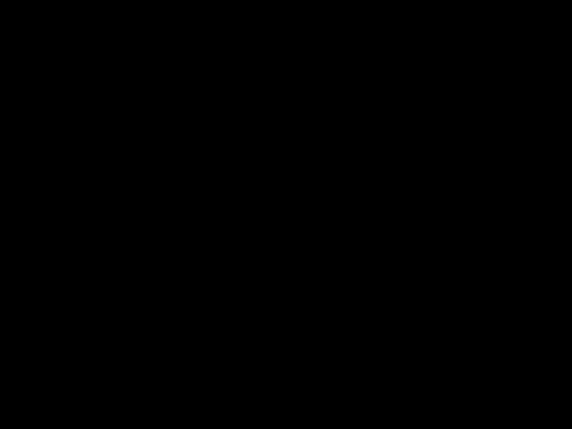

# Space and Light (C++ project '18)
Made this for a school project (used graphics library of C++ 3.0 to make it look kinda cool).
The quiz function uses an interesting point award system (points are awarded based on swiftness in answering- quicker the user response, more points will be awarded, given, the response is correct).

# Coded three animations-

# 1.Sunlight-
Shows the path of a ray of sunlight reaching earth.

# 2.Red Giant-
5 billion years from now, the sun will become a red giant. (Scary!!!)

# 3.Dispersion of light-
Dispersion of a ray of white light by a prism.

